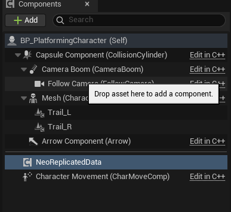
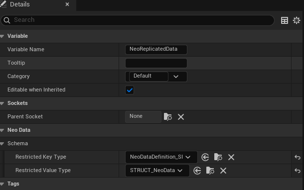
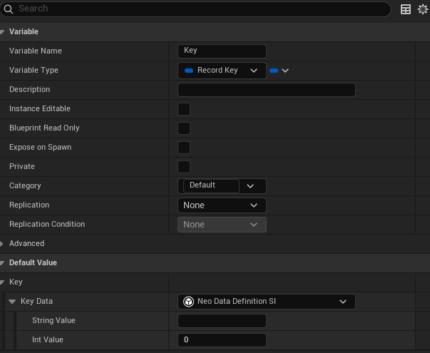
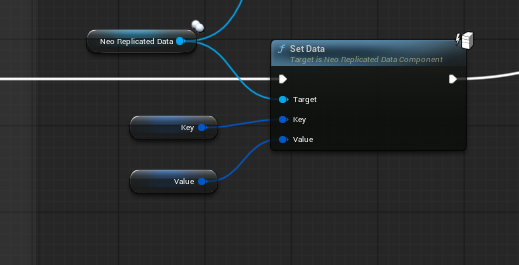
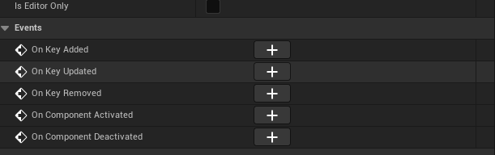
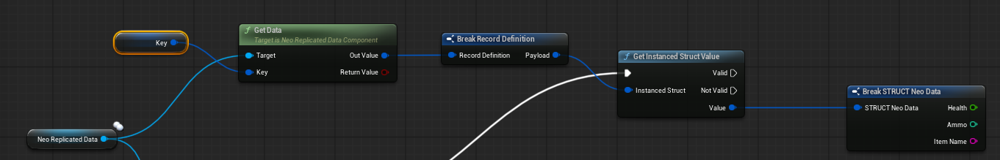

# Universal Data Sync: Dynamic Struct Replication

**Developed by NeoNexus Studios**  
*A high-performance networking solution for Unreal Engine.*

---

## Overview

**Universal Data Sync** (internally `NeoDataSync`) is a powerful Unreal Engine plugin designed to solve one of the most common headaches in multiplayer development: **Replicating arbitrary data structures without writing custom C++ for every new type.**

Powered by `FInstancedStruct` and Unreal's `FastArraySerializer`, this plugin allows you to replicate dynamic, heterogenous data over the network with minimal overhead. It is perfect for Inventory Systems, RPG Stats, Ability Cooldowns, Quest States, and any system where data requirements change frequently during development.

## Key Features

*   **Dynamic Struct Replication:** Replicate *any* `USTRUCT` marked as `BlueprintType` without modifying C++ source code.
*   **Blueprint & C++ Compatible:** Full API support for both visual scripting and native code.
*   **Fast Array Serialization:** Built on top of Unreal's most efficient replication method (`FFastArraySerializer`) for minimized bandwidth usage.
*   **Type Safety:** Includes optional schema enforcement to restrict keys or values to specific struct types.
*   **Event-Driven Architecture:** dedicated `OnKeyAdded`, `OnKeyUpdated`, and `OnKeyRemoved` events for responsive UI updates.

---

## Installation

1.  Close Unreal Editor.
2.  Copy the `NeoDataSync` folder to your project's `Plugins` directory (or the Engine's `Plugins/Marketplace` directory).
3.  Open your project.
4.  Go to **Edit > Plugins**.
5.  Search for **"Universal Data Sync"** and ensure it is enabled.
6.  Restart the Editor if prompted.

---

## Usage Guide

### 1. Setup
Add the `NeoReplicatedDataComponent` to any Actor you want to sync data for (e.g., `PlayerCharacter`, `PlayerState`, or `GameState`).



You can optionally restrict the component to only accept specific Key or Value types for type safety.



### 2. Defining Data (Blueprints)
1.  Create a standard Blueprint Struct (e.g., `FPlayerStats`) with variables like Health (Float), Ammo (Int), etc.
2.  On the Server, call `Set Data` on the component.
    *   **Key:** A unique identifier (Name/String) for this record.
    *   **Value:** Construct your struct and pass it in.

**Creating a Key Wrapper:**



**Creating a Value Wrapper:**


**Setting the Data:**



### 3. Reading Data (Blueprints)
1.  On the Client (or Server), bind to the `On Key Updated` event.
    
    

2.  When the event fires, cast the **Value** to your specific struct type (e.g., `FPlayerStats`).
3.  Use the data to update your UI or Gameplay logic.

**Getting Data:**



### 4. C++ API

```cpp
// 1. Include the Header
#include "NeoReplicatedData.h"

// 2. Define a Struct
USTRUCT(BlueprintType)
struct FMyData
{
    GENERATED_BODY()
    UPROPERTY() float Health;
    UPROPERTY() int32 Mana;
};

// 3. Set Data (Server Only)
FMyData Payload;
Payload.Health = 100.f;
Payload.Mana = 50;

MyComponent->SetTypedData(FName("HeroStats"), Payload);

// 4. Get Data
FMyData Result;
if (MyComponent->GetTypedData(FName("HeroStats"), Result))
{
    UE_LOG(LogTemp, Log, TEXT("Health: %f"), Result.Health);
}
```

---

## Technical Details

*   **Network Bandwidth:** Only changes (deltas) are sent over the network. Unchanged items in the map are not re-serialized.
*   **Supported Platforms:** Windows, Mac, Linux, Android, iOS.
*   **Engine Version:** 5.3+

## Example Data Structures

Here are some examples of how you can define structs for different game systems to use with `NeoDataSync`.

### Inventory Item
```cpp
USTRUCT(BlueprintType)
struct FNeoData_InventoryItem
{
    GENERATED_BODY()

    UPROPERTY(EditAnywhere, BlueprintReadWrite)
    FString ItemId;

    UPROPERTY(EditAnywhere, BlueprintReadWrite)
    int32 Quantity = 1;

    // Optional: Implement operator== for optimized delta replication
    bool operator==(const FNeoData_InventoryItem& Other) const
    {
        return ItemId == Other.ItemId && Quantity == Other.Quantity;
    }
};
```

### Quest Objective
```cpp
USTRUCT(BlueprintType)
struct FNeoData_QuestObjective
{
    GENERATED_BODY()

    UPROPERTY(EditAnywhere, BlueprintReadWrite)
    FText Description;

    UPROPERTY(EditAnywhere, BlueprintReadWrite)
    int32 CurrentCount = 0;

    UPROPERTY(EditAnywhere, BlueprintReadWrite)
    int32 TargetCount = 10;

    UPROPERTY(EditAnywhere, BlueprintReadWrite)
    bool bIsComplete = false;
};
```

## Practical Usage Scenarios

One of the strengths of `NeoDataSync` is that different components (or even the same component) can store completely different types of data.

### Scenario A: Inventory System
Imagine your `PlayerState` has a `UNeoReplicatedDataComponent` named **InventoryComp**. You can strictly store `FNeoData_InventoryItem` structs in it.

```cpp
// ADDING AN ITEM (Server)
void AMyPlayerState::AddItem(FString ItemId, int32 Qty)
{
    FNeoData_InventoryItem NewItem;
    NewItem.ItemId = ItemId;
    NewItem.Quantity = Qty;

    // We use the ItemId as the Map Key so looking it up is fast
    InventoryComp->SetTypedData(FName(*ItemId), NewItem);
}

// READING AN ITEM (Client/Server)
int32 AMyPlayerState::GetItemQuantity(FString ItemId)
{
    FNeoData_InventoryItem ExistingItem;
    // We try to retrieve data specifically as an InventoryItem
    if (InventoryComp->GetTypedData(FName(*ItemId), ExistingItem))
    {
        return ExistingItem.Quantity;
    }
    return 0;
}
```

### Scenario B: Quest System
On the same character, you might have another `UNeoReplicatedDataComponent` named **QuestComp**. This one stores `FNeoData_QuestObjective` structs.

```cpp
// UPDATING A QUEST (Server)
void AMyCharacter::UpdateQuestProgress(FName QuestId, int32 NewCount)
{
    FNeoData_QuestObjective Objective;
    // ... (Populate objective data) ...
    Objective.CurrentCount = NewCount;

    QuestComp->SetTypedData(QuestId, Objective);
}

// CHECKING COMPLETION (UI)
bool AMyCharacter::IsQuestComplete(FName QuestId)
{
    FNeoData_QuestObjective Objective;
    if (QuestComp->GetTypedData(QuestId, Objective))
    {
        return Objective.bIsComplete;
    }
    return false;
}
```

**Updating a Struct Payload:**


---

## Support

For bug reports or feature requests, please open an issue in the repository or contact us at:  
**NeoNexus Studios**  
*support@neonexus.studio* (Placeholder)

---
Copyright 2025-2026 NeoNexus Studios. All Rights Reserved.
